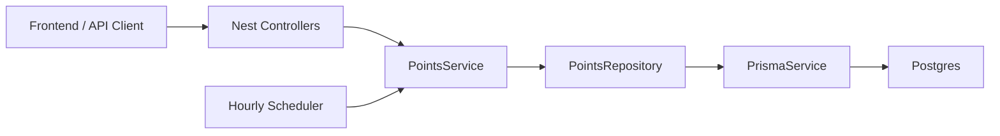
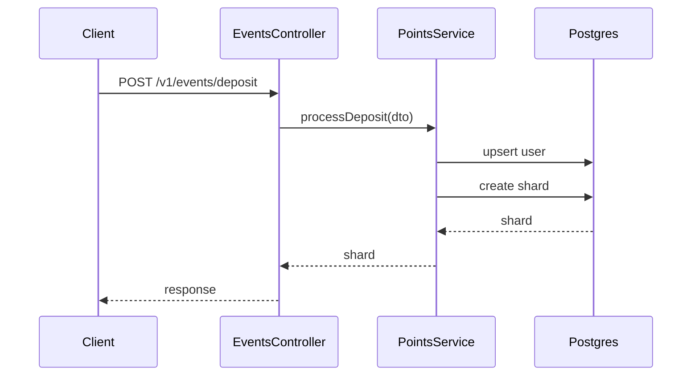

# Backend System Design

## Overview

This backend implements the off-chain accounting service for the HyperUnicorn
LP points program.

The goal is simple:

- Accept mock deposit, withdrawal, and vault multiplier events
- Track each deposit independently
- Accrue points continuously over time
- Persist user and shard state in Postgres
- Serve user balances, shard details, and an all-time leaderboard

The backend is intentionally not a full production indexer. It is a clean mock
service designed to support a frontend and make the points mechanics easy to
inspect.

---

## High-Level Architecture



### Main Modules

- `AppModule`
  - Registers config validation, scheduler support, Prisma, and points modules.

- `PrismaModule`
  - Owns `PrismaService` and `PointsRepository`.
  - Verifies the seeded protocol config row exists on startup.

- `PointsModule`
  - Owns event, user, leaderboard, and admin controllers.
  - Owns `PointsService`, which contains the points flow.

---

## Data Model

### User

```prisma
model User {
  address        String   @id
  totalPointsRaw String   @default("0")
  shards         Shard[]
}
```

The user ID is the normalized EVM wallet address.

`totalPointsRaw` is the stored crystallized point balance. It is the value used
by the all-time leaderboard.

### Shard

```prisma
model Shard {
  userAddress       String
  entrypoint        EntryPoint
  sourceId          String
  sourceAsset       String
  sourceQuantityRaw String
  sourceDecimals    Int
  principalUsdRaw   String
  accruedPointsRaw  String
  lockedRateRaw     String
  startTime         DateTime
  lastAccrualTime   DateTime
  active            Boolean
}
```

A shard is one deposit. Shards are the core accounting unit because every
deposit can have a different start time, entrypoint, locked rate, and remaining
source quantity.

Important fields:

- `principalUsdRaw`
  - Original USD value at deposit time.
  - Fixed after deposit.
  - This is the economic amount that earns points.

- `sourceQuantityRaw`
  - Native source position quantity.
  - Used for withdrawal accounting.

- `sourceDecimals`
  - Decimals for the source quantity.
  - Required to display and interpret `sourceQuantityRaw`.

- `lockedRateRaw`
  - Direct deposits lock `1.0`.
  - Vault deposits lock the current `vaultMultRaw`.
  - Existing shards are not affected by future vault multiplier changes.

- `startTime`
  - Deposit timestamp.
  - Drives the time multiplier.

- `lastAccrualTime`
  - Last timestamp the shard was crystallized to.
  - Prevents double-counting.

- `accruedPointsRaw`
  - Points earned by this shard.
  - Useful for frontend shard-level display.

### ProtocolConfig

```prisma
model ProtocolConfig {
  id           Int
  vaultMultRaw String
  mMaxRaw      String
  tCapSeconds  Int
}
```

`ProtocolConfig` stores global points settings:

- `vaultMultRaw`: multiplier for new vault deposits
- `mMaxRaw`: maximum time multiplier
- `tCapSeconds`: age where the time multiplier reaches the cap

The seed script creates the required row with `id = 1`.

---

## Points Math

Each shard accrues points using:

```txt
pointsDelta =
  principalUsdRaw
  * lockedRateRaw
  * integral(timeMultiplier)
  / POINTS_NORMALIZATION_DIVISOR
```

Current normalization divisor:

```txt
100_000
```

This keeps mock leaderboard totals readable while preserving relative rankings.

### Time Multiplier

```txt
timeMultiplier(age) =
  1 + (M_max - 1) * sqrt(min(age / T_cap, 1))
```

Current seed values:

```txt
M_max = 2.5
T_cap = 180 days
vault_mult = 1.35
```

The multiplier starts at `1.0`, ramps toward `2.5`, and then plateaus.

The backend does not tick points every second. Instead, it uses a closed-form
integral in `accrual.ts` to calculate all points earned between two timestamps
in one deterministic calculation.

---

## Core Flows

### Deposit



Deposit behavior:

- Normalize the wallet address.
- Upsert the user.
- Determine the locked rate.
- Create a new shard.
- Set `startTime` and `lastAccrualTime` to the event timestamp.

No crystallization is needed because a new shard has no prior accrual window.

### Withdrawal

Withdrawals consume active shards newest-first.

```txt
bucket = userAddress + entrypoint + sourceAsset + sourceDecimals
```

For each shard consumed:

1. Crystallize points to the withdrawal timestamp.
2. If the shard is fully consumed, mark it inactive.
3. If partially consumed, reduce:
   - `sourceQuantityRaw`
   - `principalUsdRaw`

Partial principal reduction is proportional:

```txt
principalToRemove =
  shardPrincipal * withdrawnSourceQuantity / shardSourceQuantity
```

This keeps USD principal and source quantity aligned without repricing.

### Crystallization

Crystallization turns pending accrual into stored state.

For one shard:

```txt
delta = points earned from lastAccrualTime to timestamp
User.totalPointsRaw += delta
Shard.accruedPointsRaw += delta
Shard.lastAccrualTime = timestamp
```

Crystallization happens:

- During withdrawals
- Once per hour through the scheduler
- Manually through `POST /v1/admin/crystallize`

### Virtual Reads

User and shard read endpoints return stored points plus a read-time virtual
delta.

Virtual reads do not mutate the database.

The backend buckets the read timestamp to the previous minute, so repeated
requests inside the same minute return stable values:

```txt
asOf = floor(now / 1 minute) * 1 minute
```

This lets the frontend cache or animate values without the backend returning a
slightly different number on every request.

### Leaderboard

The leaderboard is intentionally simple in this version:

```http
GET /v1/leaderboard
```

It ranks users by stored `totalPointsRaw`.

The hourly crystallization cron keeps stored totals reasonably fresh. The
leaderboard does not use virtual deltas, weekly windows, monthly windows, or
bonus points in this version.

---

## API Surface

### Event APIs

```http
POST /v1/events/deposit
POST /v1/events/withdraw
POST /v1/events/vault-mult-changed
```

These endpoints simulate the event stream that a real chain indexer would
provide.

### User APIs

```http
GET /v1/users/:address/points
GET /v1/users/:address/shards
```

These return formatted and raw point values for frontend display.

### Leaderboard API

```http
GET /v1/leaderboard
```

Returns all users ranked by stored total points.

### Admin API

```http
POST /v1/admin/crystallize
```

Manually crystallizes all active shards.

This is public in the mock backend. In a production system it would need auth.

---

## Error Handling

The backend registers a global `PrismaExceptionFilter`.

It maps common Prisma failures into stable HTTP errors:

- Unique constraint failures
- Missing records
- Foreign key failures
- Database initialization failures
- Generic database request failures

The filter also logs request path, method, Prisma code, and Prisma metadata
when available.

---

## Seed Strategy

The seed script creates:

- Protocol config
- Four active shard-driven demo users
- Leaderboard-only users with pre-filled point totals
- Procedural filler users for a realistic leaderboard distribution

The shard-driven users demonstrate:

- Long-running vault deposit
- Vault DCA-style deposits
- Mixed direct and vault deposits
- High-frequency direct LP deposits

Seeded shard users start with uncrystallized shard state, so the frontend can
exercise virtual reads and crystallization behavior.

---

## Why These Choices

### Why Shards?

Merging deposits into one balance would make partial withdrawals and rate
changes hard to reason about. Shards preserve the history that matters:

- how much was deposited
- when it was deposited
- which rate was locked
- how much of the source position remains

### Why Fixed USD Principal?

The system needs one common unit across vault shares, LP positions, and assets
with different decimals. Original USD value gives us that common unit.

The backend does not re-mark principal after deposit. This avoids oracle
complexity and makes rewards predictable.

### Why Source Quantity?

USD principal earns points, but source quantity controls withdrawals.

If a user withdraws 25% of the native position, the backend removes 25% of the
remaining principal from that shard.

### Why Closed-Form Accrual?

Closed-form accrual avoids a noisy ticking process. The backend can calculate
exactly what a shard earned between two timestamps whenever it needs to.

### Why Stored and Virtual Points?

Stored points are stable and useful for leaderboard ranking.

Virtual points are useful for frontend display between crystallization runs.

---

## Current Limitations

- No auth on event or admin endpoints
- No real event indexing
- No event replay or idempotency key
- No oracle validation
- No TGE snapshot process
- No time-windowed leaderboard history
- No bonus point ledger
- No sybil controls

These are explicit v1 tradeoffs, not accidental omissions.

---

## Future Improvements

1. Add an append-only event log for replayability.
2. Add authenticated admin actions.
3. Add TGE snapshot and allocation export.
4. Add weekly/monthly leaderboard windows.
5. Add a bonus issuance ledger.
6. Add source registry validation.
7. Add stronger invariant tests around withdrawals and crystallization.
8. Add a real chain indexer integration.
